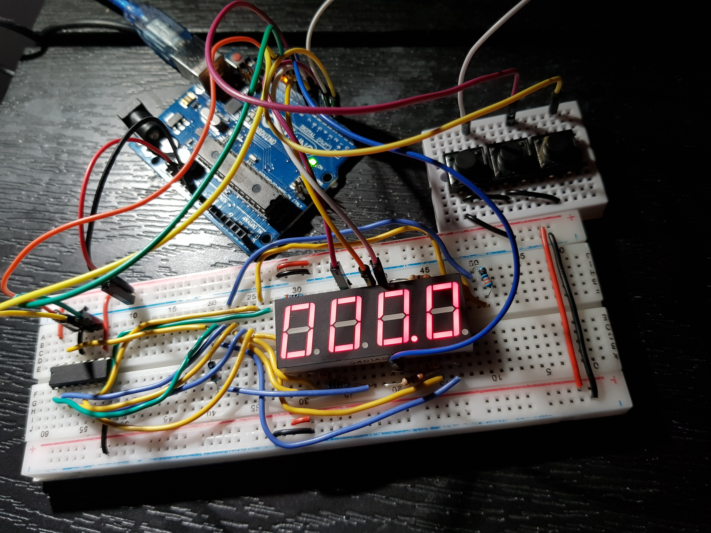

# Introduction to Robotics (2023 - 2024)
This repo is designed to track my progress through the homework of the Introdution to Robotics Uni course. 

This is a mandatory course taken in the 3rd year of my scholarship at the Faculty of Mathematics and Computer Science, University of Bucharest.  

Throughout this repo you can find homework-specific requirements, implementation details, code, image files and more.

## Homework 1

Create this repo, doesn't get much easier than that.

## Homework 2

 <B>Control RGB LED</B> 

### Task 

Use a separate potentiometer for controlling each color of an RGB LED: Red,
Green, and Blue.

The purpose of this homework is to leverage digital electronics.
Although this could be done by using the potentiometer's output as an input for each
LED color, it is important to understand the use of an analog input and PWM output
via the Arduino to be able to control a variety of electronics using the MCU.

Specifically, for this task you need to read the potentiometer’s value 
using an Arduino and then write a mapped value of that to the LED's input pins.

### Hardware Implementation

#### Components:
* an Arduino UNO
* the common Cathode RGB LED
* three 50KΩ potentiometer
* four 100Ω resistors. 
The Blue and Green LEDs needed 90Ω resistors to funciton so I used one 100Ω resistor for each
and for the Red LED I used two 100Ω resistors in series to get a 200Ω resistence, as the required resistence for the Red LED was 150Ω.
* multi-coloured wires, properly colour-coded  

Below is a youtube link that shows the homework in action and there is also a picture of the project.

https://www.youtube.com/shorts/vDVLX95Q7Ww 

## Homework 3

 <B> Elevator Simulator </B>

### Task 

Design a control system that simulates a 3-floor elevator using the Arduino
platform. Here are the specific requirements:

* LED Indicators: Each of the 3 LEDs should represent one of the 3 floors.
The LED corresponding to the current floor should light up. Additionally,
another LED should represent the elevator’s operational state. It should
blink when the elevator is moving and remain static when stationary.

* Buzzer: The buzzer should sound briefly during the following scenarios:
  * Elevator arriving at the desired floor (something resembling a ”cling”). I ended
    up playing a melody when opening and closing the door.
  * Elevator movement.

* State Change & Timers: If the elevator is already at the desired floor,
pressing the button for that floor should have no effect. Otherwise, after
a button press, the elevator should ”wait for the doors to close” and then
”move” to the corresponding floor. If the elevator is in movement, it
should either do nothing or it should stack its decision (get to the first
programmed floor, open the doors, wait, close them and then go to the
next desired floor).

* Debounce: Remember to implement debounce for the buttons to avoid
unintentional repeated button presses.

### Hardware Implementation

I ended up using:
* 3 Red LEDs
* 1 Green LED
* 4 330Ω Resistors for the LEDs
* 1 100Ω Resistor for the buzzer
* a buzzer
* three push buttons
* wires
* an Arduino Uno

Below is a youtube link that shows the homework in action and there is also a picture of the project.

https://www.youtube.com/watch?v=6XHYGthXycI

## Homework 4

 <B> Draw On 7 Segment </B>

### Task 

Use the joystick to control the position of the segment cursor and ”draw” on the display
by pressing on the joystick button. The movement between segments should be natural. 
The cursor is only allowed to jump from the current position to neighboring ones, 
without passing through walls or jumping over neighbors.

In order to make it more obvious what LED the cursor is on, what I did is color the LED instantly with
the oposite color it already has (if it's black i make the blink start from red and vice versa)

#### Behaviour

The initial position should be on the DP (decimal point). The current cursor
position always blinks (irrespective of the fact that the segment is on or
off). Use the joystick to move from one position to neighboring ones. (see table for
corresponding movement). Short pressing the button toggles the segment
state from ON to OFF or from OFF to ON. Long pressing the button
resets the entire display by turning all the segments OFF and moving the
current position to the decimal point. Interrupts are required.

### Hardware Implementation

I used:
* 8 330Ω Resistors for the segments
* one 7 segment display
* wires
* an Arduino Uno
* a Joystick

Below is a youtube link that shows the homework in action and there is also a picture of the project.

https://www.youtube.com/watch?v=VlsCClYC-cU

## Homework 5

 <B> Basic Timer With Laps </B>

### Task 

Using the 4-digit 7-segment display and 3 buttons, you should implement a
stopwatch timer that counts in 10ths of a second and has a save lap functionality
(similar to most basic stopwatch functions on most phones).

#### Behaviour

1. The beginning state of the stopwatch is ”000.0”. 
When pressing the Start button, the timer should start.

2. While the timer is running, laps should be stored in memory, 
(up to 4 laps). pressing the lap button for the 5th time 
should override the 1st saved one. If you press the reset
button while timer is running, nothing happens. If you press the pause
button, the timer stops.

3. In Pause Mode, the lap button doesn’t work anymore. Pressing
the reset button resets you to 000.0.

4. After reset you can press the lap button to cycle through the
lap times. Each time you press the button, it takes you to the
next saved lap. Pressing it continuously should cycle you through it
continuously. Pressing the reset button while in this state resets all
your flags and takes the timer back to ”000.0”.

5. My extra input: I only display the saved laps. If the user only saves 
three laps, I don't display the 4th "empty" one as 000.0. Instead i cycle to 
the first lap. I also mate it impossible to reset the laps without viewing them first
to prevent accidental data loss.
### Hardware Implementation

I used:
* 8 330Ω Resistors for the segments
* one 4 digit 7 segment display
* wires
* an Arduino Uno
* 3 buttons
* a shift register

Below is a youtube link that shows the homework in action and there is also a picture of the project.

https://www.youtube.com/watch?v=ulKlsE1wnI8

## Homework 6

 <B> Environment monitor </B>

### Writer's notes

This homework is partially at fault for some of my early male pattern baldness. A lot of code to write, 
borderline useless final product, no inspiration in sight to programme it. 800 lines of the most boaring repetitive code. I'm glad this one's done. Probably the worst homework this cours had to offer.

### Task 

Develop a ”Smart Environment Monitor and Logger” using Arduino. This system will utilize various sensors to gather environmental data, log this data into EEPROM, and provide both visual 
feedback via an RGB LED and user interaction through a Serial Menu. The project focuses on integrating sensor readings,
memory management, Serial Communication and the general objective of building a menu.

#### Menu Structure

1. Sensor Settings 
  * Sensors Sampling Interval. Here you should be prompted for
a value between 1 and 10 seconds. Use this value as a sampling rate
for the sensors. You can read a separate value for each or have the
same for both.
  * Ultrasonic Alert Threshold. Here you should be prompted
for a threshold value for the ultrasonic sensor. You can decide if that
is the min or max value (you can signal that something is too close).
When sensor value exceeds the threshold value, an alert should be
given. This can be in the form of a message. If the LED is set to
Automatic Mode (see section 4.2), it should also turn red if any of
the sensors are outside the value.
  * LDR Alert Threshold. Here you should be prompted for a
threshold value for the LDR sensor. You can decide if that is the
min or max value (for example, it could signal that night is coming).
When sensor value exceeds the threshold value, an alert should be
given. This can be in the form of a message. If the LED is set to
Automatic Mode (see section 4.2), it should also turn red if any of
the sensors are outside the value.
  * Back // Return to main menu

2. Reset Logger Data. Should print a message, promting if you to
confirm to delete all data. Something like ”are you sure?”, followed by
the submenu with YES or NO. You can reset both sensor data at the same
time, or you can do it individually. Your choice. I did it individually.
  * Yes.
  * No.

3. System Status // Check current status and health
  * Current Sensor Readings. Continuously print sensor readings
at the set sampling rate, from all sensors. Make sure you have a way
to exit this (such as pressing a specific key) and inform the user of
this method through a message.
  * Current Sensor Settings. Displays the sampling rate and
threshold value for all sensors.
  * Back. Return to Main menu.

4. RGB LED Control // Go to submenu
  * Manual Color Control. Set the RGB colors manually. You
decide how to input them, either by making an option for each chan-
nel, or by putting a string etc. If you expect a specific format, make
sure to inform the user.
  * LED: Toggle Automatic ON/OFF. If automatic mode is
ON, then the led color should be GREEN when all sensors value do
not exceed threshold values (aka no alert) and RED when there is an
alert (aka ANY sensor value exceeds the threshold). When automatic
mode is OFF, then the LED should use the last saved RGB values.
  * Back // Return to main men

### Hardware Implementation

I used:
* 3 330Ω Resistors for the segments
* one ultrasonic sensor
* one photoresistor
* an Arduino Uno
* an RGB LED

Below is a youtube link that shows the homework in action and there is also a picture of the project.

https://www.youtube.com/watch?v=DZubaUXpZoM

