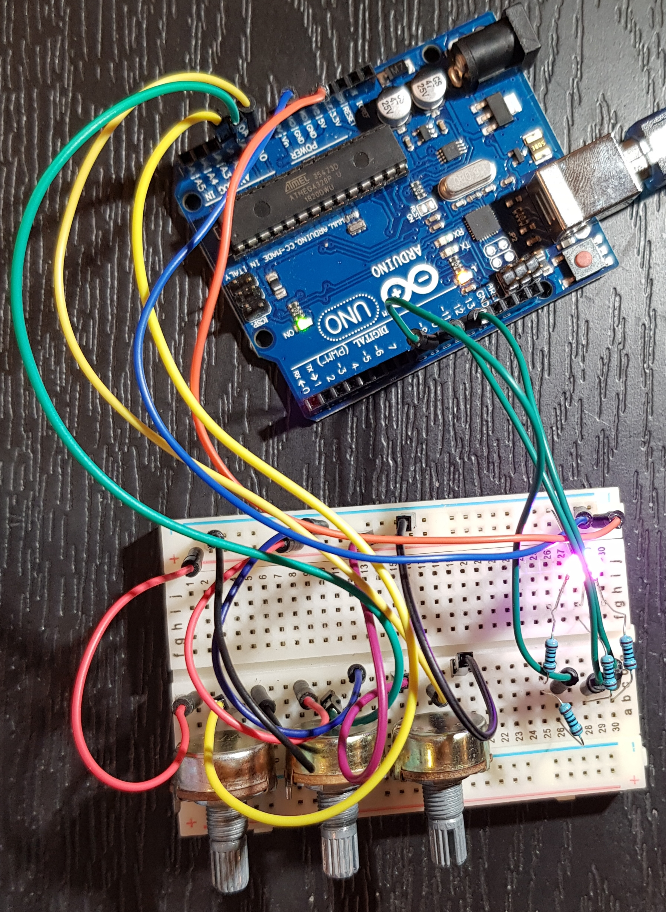

# Introduction to Robotics (2023 - 2024)
This repo is designed to track my progress through the homework of the Introdution to Robotics Uni course. 

This is a mandatory course taken in the 3rd year of my scholarship at the Faculty of Mathematics and Computer Science, University of Bucharest.  

Throughout this repo you can find homework-specific requirements, implementation details, code, image files and more.

## Homework 1

Create this repo, doesn't get much easier than that.

## Homework 2

### Task 

Use a separate potentiometer for controlling each color of an RGB LED: Red,
Green, and Blue.

The purpose of this homework is to leverage digital electronics.
Although this could be done by using the potentiometer's output as an input for each
LED color, it is important to understand the use of an analog input and PWM output
via the Arduino to be able to control a variety of electronics using the MCU.

Specifically, for this task you need to read the potentiometer’s value 
using an Arduino and then write a mapped value of that to the LED's input pins.

### Hardware Implementation

#### Components:
* an Arduino UNO
* the common Cathode RGB LED
* three 50KΩ potentiometer
* four 100Ω resistors. 
The Blue and Green LEDs needed 90Ω resistors to funciton so I used one 100Ω resistor for each
and for the Red LED I used two 100Ω resistors in series to get a 200Ω resistence, as the required resistence for the Red LED was 150Ω.
* multi-coloured wires, properly colour-coded  

Below is a youtube link that shows the homework in action and there is also a picture of the project.

https://www.youtube.com/shorts/vDVLX95Q7Ww 

